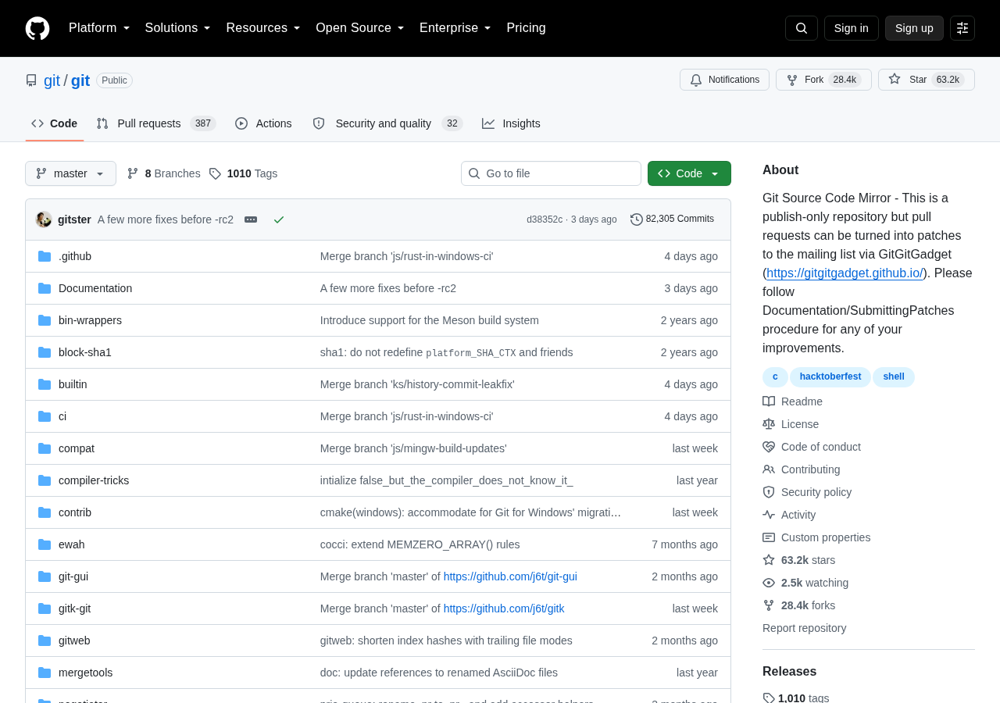
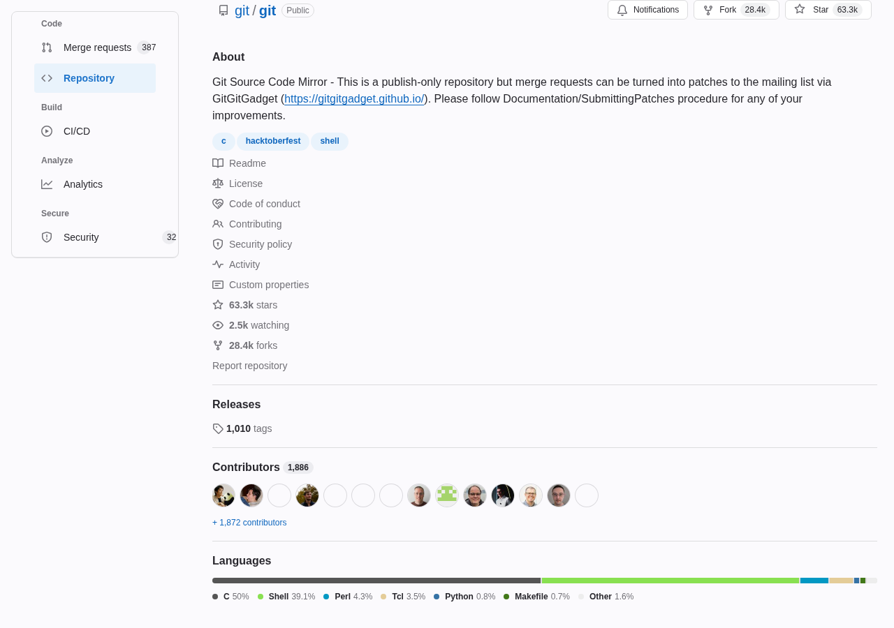

# GitAlike

Use any forge, keep your muscle memory.

[](https://github.com/ranjithrajv/gitalike/actions/workflows/ci.yml)
[](https://github.com/ranjithrajv/gitalike/releases/latest)
[](LICENSE)
[](https://ranjithrajv.github.io/gitalike/privacy.html)

**Nothing else makes GitHub read like GitLab — and back.** GitAlike re-skins the
forge in front of you as the product you know best — GitHub, GitLab or Bitbucket
— down to the words, the navigation, the `#42` / `!42` reference markers and the
`g`-shortcuts. It is reciprocal, in both directions, and it covers the forges
people actually use: GitHub, GitLab, Codeberg/Gitea, Bitbucket, Gerrit and any
instance you add.

It is a reskin, not a service. No account, no network requests, no telemetry, no
remote code: both stylesheets ship in the bundle and every mark is an inline data
URI. It changes nothing about what the site *does* — no requests are intercepted,
no data is touched — and every change is recorded and reverted exactly the moment
you switch a skin off.

<p align="center">
  
  
</p>

<p align="center"><em>The same GitHub project page: default on the left, with the GitLab UI applied on the right. <a href="https://ranjithrajv.github.io/gitalike/">Drag the divider on the live preview →</a></em></p>

Three skins — **GitLab**, **GitHub** and **Bitbucket** — and any host you have
set up can wear any of them from the popup.

```
 a GitHub-flavoured site  + GitLab UI     ->  GitAlike mark, purple accents, light bar
 a GitLab-flavoured site  + GitHub UI     ->  GitAlike mark, blue accents, dark bar
 any site                 + Bitbucket UI  ->  GitAlike mark, Atlassian blue bar
```

- **Reciprocal.** GitHub shown as GitLab and GitLab shown as GitHub — both
  directions, not one.
- **Semantic.** It does not stop at colour: the words, the navigation, the
  reference markers and the `g`-shortcuts follow the skin.
- **Local.** No account, no network requests, no telemetry, no remote code.
- **Reversible.** Every change is recorded, and undone the moment the skin is
  switched off.

It works on `github.com`, `gitlab.com`, `codeberg.org`, `gitea.com` and
`bitbucket.org` out of the box. Any other instance — a self-hosted GitLab,
**GitHub Enterprise Server**, a Bitbucket Data Center, a **Gerrit** — is added
from the popup, which asks for that one site's access.

GitAlike starts with the two big forges, GitHub and GitLab, and grows from
there. The GitHub-flavoured **Codeberg** (Forgejo) and **gitea.com** (Gitea) are
bundled too — they speak GitHub's dialect, so by default they are shown with the
GitLab UI, and the per-site picker can show them with the GitHub or Bitbucket UI
instead. **Bitbucket** is a source as well as a target: a Bitbucket host can be
shown with the GitHub or GitLab UI. **Gerrit** is a source too, added by
instance. Sourcehut is the next candidate. A forge that already speaks one of the
two dialects needs only to be classified as that kind of site; until then, any
instance works today through the popup's **Add a site** flow. If you would like
to help add one, see
[CONTRIBUTING.md](CONTRIBUTING.md#adding-another-forge--contributions-welcome).

GitAlike is an independent project. It is not affiliated with, endorsed by or
sponsored by GitHub, Inc. or GitLab Inc., and it ships none of their artwork:
the mark it paints on a skinned page is its own. GitHub is a trademark of
GitHub, Inc. GITLAB is a trademark of GitLab Inc. in the United States and other
countries and regions.

**Live preview:** <https://ranjithrajv.github.io/gitalike/> — drag the divider
and watch each site wear every skin it can.

## Contents

- [Make GitHub look like GitLab, and back](#make-github-look-like-gitlab-and-back)
- [Install](#install)
  - [From source](#from-source)
- [Use](#use)
- [Adding a self-hosted instance](#adding-a-self-hosted-instance-github-enterprise-gitlab-bitbucket-gerrit)
- [UX parity](#ux-parity)
- [Known limitations](#known-limitations)
- [Privacy](#privacy)
- [Contributing](#contributing)
- [Trademarks](#trademarks)
- [License](#license)

## Make GitHub look like GitLab, and back

A theme repaints the palette and stops there. GitAlike also changes the *words*
the page uses, the *navigation* it shows, the reference markers and the keyboard
shortcuts — reciprocally, and it undoes every change the moment you switch it
off.

| Capability | A userstyle or theme | GitAlike |
| --- | --- | --- |
| Repaints the palette | yes | yes |
| Renames the product's words ("Pull request" ⇄ "Merge request", "Actions" ⇄ "CI/CD") | no | yes |
| Rebuilds navigation (GitHub's tab row ⇄ GitLab's grouped sidebar) | no | yes |
| Switches reference markers (`#42` ⇄ `!42`) | no | yes |
| Delivers the other product's `g`-shortcuts | no | yes |
| Works in both directions (GitHub shown as GitLab, and the reverse) | rarely | yes |
| Reverts exactly when turned off | — | yes |
| No account, no network requests, no telemetry | often | yes |

## Install

> **In review on the Chrome Web Store and addons.mozilla.org.** While those
> listings are pending, download the ZIP for your browser below and follow the
> steps to load it yourself.

<a href="https://github.com/ranjithrajv/gitalike/releases/latest/download/gitalike-chromium.zip"></a>
<a href="https://github.com/ranjithrajv/gitalike/releases/latest/download/gitalike-firefox.zip"></a>

Both links follow the newest release. The asset names deliberately carry no
version number, so `/releases/latest/download/...` keeps working as releases
pile up.

**Chromium** (also loads in Chrome, Edge, Brave, Opera, Vivaldi and the other
Chromium-based browsers, which share the API)

1. Unzip `gitalike-chromium.zip`
2. Go to `chrome://extensions` — that is Chromium's own URL scheme, not a typo
3. Turn on **Developer mode**
4. **Load unpacked** → choose the unzipped folder

Load unpacked takes a **folder**, not the ZIP, and it loads the extension from
wherever that folder lives — so do not move or delete it afterwards.

**Firefox**

`gitalike-firefox.zip` needs Firefox **142 or newer**, and works in the forks
that track it (LibreWolf, Floorp, Zen, …). It is unsigned, so Firefox will only
load it **temporarily** — it is gone when the browser restarts. A permanent
install comes from addons.mozilla.org.

1. Go to `about:debugging#/runtime/this-firefox`
2. **Load Temporary Add-on…** → choose `gitalike-firefox.zip` itself; it does not
   need unzipping

### From source

Build it yourself instead. (The build step exists because Chromium and Firefox
declare their Manifest V3 background context differently — Chromium wants a
service worker, Firefox wants an event page.)

```sh
npm run build            # builds dist/chromium and dist/firefox
# or
npm run build:chromium
npm run build:firefox
```

Then load `dist/chromium` as an unpacked extension, or `dist/firefox/manifest.json`
through `about:debugging`.

> **About the permission prompt.** The install prompt covers the public forges
> and Codeberg; a self-hosted instance is granted one origin at a time when you
> add it. The extension adds a class to `<html>` on sites you have explicitly set
> up, does nothing elsewhere, and sends no data anywhere: there are no network
> requests at all, both stylesheets are bundled, and the logos are inline data
> URIs. The one thing that does leave the machine is `chrome.storage.sync` — the
> settings and the hostnames you add are synced by your browser to your account,
> and nothing read from a page is ever put there. The reasoning is in
> [CONTRIBUTING.md](CONTRIBUTING.md#why-it-matches-every-site).

## Use

Open the toolbar popup. **Show the web with** is one radio group — **GitLab UI**,
**GitHub UI**, **Bitbucket UI** or **Off** — so exactly one skin is active at a
time. Each option lists the hosts it covers:

| Choice            | Normally covers                                                                                          | Result               |
| ----------------- | -------------------------------------------------------------------------------------------------------- | -------------------- |
| **GitLab UI**     | `github.com`, `codeberg.org`, `gitea.com`, `bitbucket.org`, your GitHub Enterprise and Gerrit instances    | rendered as GitLab   |
| **GitHub UI**     | `gitlab.com`, `codeberg.org`, `gitea.com`, `bitbucket.org`, your GitLab and Gerrit instances               | rendered as GitHub   |
| **Bitbucket UI**  | every host you have set up                                                                                | rendered as Bitbucket |
| **Off**           | —                                                                                                        | each site's own UI   |

It starts on **Off**. A choice applies to every host it covers at once, and the
option covering the site you are on is highlighted.

When you are on a site GitAlike knows, a **Show *this site* with** picker below
lets you choose the skin for that one host — **Off**, **GitHub UI**,
**GitLab UI** or **Bitbucket UI** — so one enterprise instance can wear a
different skin (or none) without changing `github.com`. Choosing a site's own UI
(`github.com` shown as GitHub, `gitlab.com` shown as GitLab) is the same as
**Off**, because GitAlike does not repaint a site as itself. Bitbucket is never
a site's own UI — no forge is Bitbucket's markup — so it always paints.
**Follow the global skin** clears the per-site choice.

**Keyboard:** `Alt` + `Shift` + `G` toggles the current site (the same per-site
choice). It can only toggle a site that is already set up — telling GitHub from
GitLab is a choice, so the first time has to go through the popup.
`Alt` + `Shift` + `O` opens the current page on the other host (the two public
forges only). Rebind either at `chrome://extensions/shortcuts` (Firefox:
`about:addons` → gear → *Manage Extension Shortcuts*).

While a skin is active the toolbar icon shows a small **GL** or **GH** badge.

## Adding a self-hosted instance (GitHub Enterprise, GitLab, Bitbucket, Gerrit)

Any host the extension has not seen before is left completely alone. There are
two ways in, and they open the same form. **GitAlike reads the address and
highlights the product it looks like** — a deep link such as
`/-/merge_requests/42` names GitLab, `/pull/42` names GitHub, `/pulls/42` names
Gitea/Forgejo, `/pull-requests/42` names Bitbucket and `/c/project/+/42` names
Gerrit, even on a host it has never seen — so usually you just confirm the
highlighted button. It reads the link only, never the page, and makes no
network request. The buttons ask **which product the site is**, not which skin
you want — a GitHub Enterprise server is a GitHub site, so choosing **GitHub** is
what gives it the GitLab UI.

**From the page you are on.** Open the popup; when the host in front of you
needs a decision the form is already open and filled in.

1. Open the popup on the instance. It reads *"`github.acme.com` is not set up"*,
   prefills the field, and highlights the product the link points at.
2. Choose **GitHub**, **GitLab**, **Bitbucket** or **Gerrit** — or just press the
   highlighted one. It is remembered, and the skin switches on immediately on
   the page you already have open — no reload.

**By typing the address.** You do not have to visit an instance to add it, which
is the point when the address is one you would have to look up:

1. Open the popup and click **Add a site**.
2. Paste the address. A bare host (`github.acme.com`) and a full URL
   (`https://GitHub.Acme.com/pulls?q=1`) both work. Only the hostname is kept,
   because a port or path would never match the host you actually land on. An
   `http://` address is accepted but flagged — the skin still applies, though the
   connection is not encrypted.
3. Choose **GitHub**, **GitLab**, **Bitbucket** or **Gerrit**, or press the
   highlighted product. Pressing **Enter** takes the highlighted one.

Anything that is not a web address is refused rather than stored, including
`javascript:` and other non-http schemes. Built-in hosts
(`github.com`, `gitlab.com`, `codeberg.org`, `gitea.com`, `bitbucket.org`) are
refused too — they are already set up and cannot be removed.

To undo, open the popup on that host and choose **Remove**. That also clears any
per-site skin choice on it.

## UX parity

The skin is not only colour. While a skin is on, GitAlike also matches the other
product's *vocabulary and habits*:

| Surface    | What changes                                                                                                     |
| ---------- | ---------------------------------------------------------------------------------------------------------------- |
| Copy       | "Pull request(s)" ⇄ "Merge request(s)", "Insights" ⇄ "Analytics", "Actions" ⇄ "CI/CD", "Go to file" ⇄ "Find file", "Gists" ⇄ "Snippets", "Codespaces" ⇄ "Workspaces" |
| Navigation | repo tabs are relabelled ("Code" ⇄ "Repository") and given the other product's tab set and order — GitLab's are rebuilt as GitHub's tabs, GitHub's are gathered under GitLab's group headings |
| Orientation | GitHub's logged-out top bar is restyled as GitLab's light bar, and its signed-in app header (`.AppHeader` / `header.GlobalNav`) is hidden outright — GitLab has no top menubar; its repo/profile tabs become a GitLab-style left sidebar/rail with GitLab group headings; GitLab's scattered sidebar is rebuilt as GitHub's flat tab row, under the repository header |
| Metadata | GitHub's right-hand "About" becomes a full-width block on top (GitLab style); GitLab's "Project information" becomes a right sidebar (GitHub style) |
| References | a pull/merge-request link shows the other product's marker — `#42` ⇄ `!42`                                        |
| Shortcuts  | the other product's `g`-combos work: on GitHub shown as GitLab, `g m` opens merge requests                        |
| Other host | open the same page on the other forge, from the popup or `Alt` + `Shift` + `O`                                     |
| No counterpart | a feature the other product lacks is marked `≠ GitLab` / `≠ GitHub` instead of pretending it exists             |
| Account chrome | "Your repositories" ⇄ "Your projects", "Your gists" ⇄ "Your snippets", "Your stars" ⇄ "Starred projects", "Your organizations" ⇄ "Your groups" |

It is deliberately conservative. Copy is rewritten only in ordinary page text —
never inside code, inputs or editable regions — control words like the merge
button ("Merge pull request" ⇄ "Merge") change only on an exact whole-label match
on a button, tab, menu item or link, and navigation labels change only on an
exact whole-label match inside a known nav region, so prose and marketing copy are
safe. A reference marker is only touched on a link that is *just* a number. Every
change is recorded, and undone exactly when the skin is switched off.

The full status matrix — what each direction covers, and the few things that are
deliberately one-way — is in [docs/UX-PARITY.md](docs/UX-PARITY.md).

## Known limitations

GitAlike is deliberately conservative, and it is honest about the edges. The
short version:

- **UX parity is conservative, not exhaustive.** Only vocabulary that maps
  cleanly is rewritten; a concept with no counterpart is marked (`≠ GitHub` /
  `≠ GitLab`) rather than guessed at. Copy is never touched inside code, inputs
  or editable regions.
- **The keyboard remap is best-effort.** Where the destination has a link the
  combo clicks it; `g n` (notifications) has no link, so it works only on GitHub.
- **Bitbucket and Gerrit as sources are vocabulary-only**, and Gerrit has no
  bundled host — add it by instance.
- **The skin is cosmetic, and the page can influence it.** It is not a security
  boundary; do not treat it as a trust signal.
- **Access is bundled hosts at install, one origin at a time after that.** There
  is no all-sites grant.
- **“Open on the other host” covers the two public forges only.**

The full list — the rebuilt tab strips, the first-paint `localStorage` cache,
global-versus-per-host skins, how the Bitbucket palette was verified from a
capture, the Codeberg/Gitea partial pass, the mark’s provenance and the
`gitlab.com/` redirect — is in
[docs/LIMITATIONS.md](docs/LIMITATIONS.md).

## Privacy

GitAlike collects no data and makes no network requests. It stores only your
on/off choices — including any per-site skin choices — and the list of instances
you add, in the browser's own synced extension storage, and caches the per-site
decision in the page's `localStorage` so a repeat visit does not flash the
original theme.
Nothing read from a page is stored or sent anywhere. The full policy is at
<https://ranjithrajv.github.io/gitalike/privacy.html>.

## Contributing

Bug reports and pull requests are welcome. The popup's **Report a missed spot**
link opens a prefilled issue with the host and skin already filled in. The
developer guide — build, test, the ground rules, and how to add a forge or a
translation — is in [CONTRIBUTING.md](CONTRIBUTING.md).

New **plugins** are welcome: a *skin* (a target UI) is one object plus one
stylesheet, and a *source* (a forge's markup) is one object.
`node tools/new-plugin.mjs skin <name>` scaffolds one and relists it; the
registry is also published as [`plugins.json`](plugins.json). See
[Adding a skin](CONTRIBUTING.md#adding-a-skin) and
[Adding another forge](CONTRIBUTING.md#adding-another-forge--contributions-welcome),
or [propose one](https://github.com/ranjithrajv/gitalike/issues/new?template=new_plugin.yml).
The live registry is on the [site](https://ranjithrajv.github.io/gitalike/#plugins).

## Trademarks

GitHub and the Octocat are trademarks of GitHub, Inc. GITLAB is a trademark of
GitLab Inc. in the United States and other countries and regions, and GitLab's
Tanuki logo is a GitLab Inc. trademark. GitAlike is not affiliated with,
endorsed by or sponsored by either company. It names those products only to
describe what it is compatible with, and it redistributes none of their logos
or other brand artwork — the mark it paints on a page is GitAlike's own.

## License

GPL-3.0-or-later — see [LICENSE](LICENSE) for the full text and
[NOTICE](NOTICE) for the copyright and the name/mark term.

GitAlike is free software: you can redistribute it and/or modify it under the
terms of the GNU General Public License as published by the Free Software
Foundation, either version 3 of the License, or (at your option) any later
version. It comes with no warranty. A fork that is distributed to others has to
stay free software too; the source is at
<https://github.com/ranjithrajv/gitalike>.
